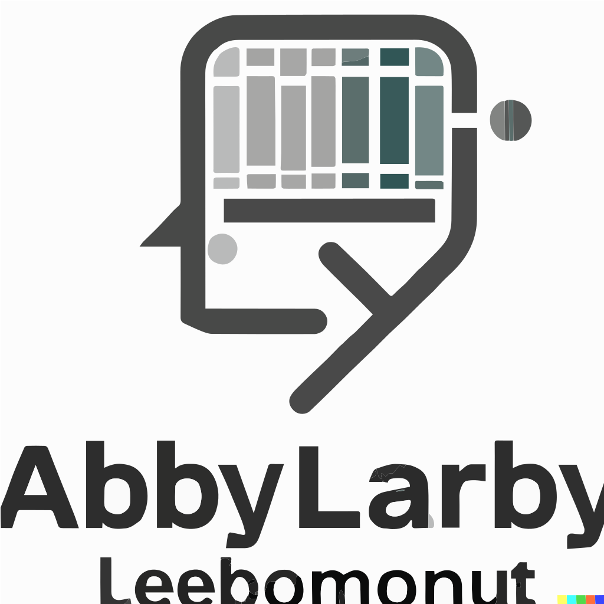

AbbyLarby is a Slack bot for connecting to generative AI helpers.

# Features

## /ai slash command

Available commands:
* `/ai <prompt>`: Show the OpenAI text API's response to `<prompt>`. Visible only to you.
* `/ai img <prompt>`: Show the Dall-E image generated by `<prompt>`. Visible only to you.
* `/ai say <prompt>` or * `/ai say img <prompt>`: immediately post the result to the channel.

## Conversation bot

Have a longer conversation by talking directly with the bot in the app Messages tab.

The bot can also be added to any channel, and then will respond to @ mentions.

# Configuration

Configuration is via the environment variables set in `.env.example`. You can copy the file to `.env` or set environment
variables another way.

* `MODEL`: a model using the OpenAI chat API, e.g. "gpt-4" or "gpt-3.5-turbo".
* `MODEL_MAX_TOKENS`: the maximum number of tokens allowed by the given model. For cost, it may be useful to set this
  lower than the actual max, as a long conversation or a question in a long public channel can generate a lot of context.
* `HIDDEN_PROMPT_URL`: A url containing text to provide as the system prompt to the bot.
  All paragraph tags, whose text does not start with `#`, will be included as paragraphs at the
  start of the hidden prompt. The URL will be refetched once every five minutes. A Google Doc
  that is published to the web works well as a hidden prompt URL.

# Dev setup

(lazy requirements for now)

    pip install requirements.txt

Copy .env.example to .env and write credentials.

Run dev server:

    watchmedo auto-restart python aibot.py

This uses sockets to talk to Slack, so dev bot will be live if you're using live credentials.

# Server hosting

Just keep `python aibot.py` running on the server. See `Procfile` for running with Dokku.